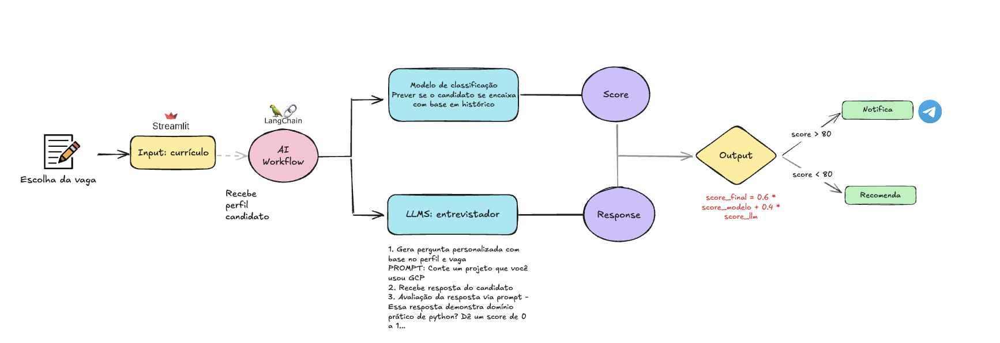

# 🎯 AI Job Matching Platform

**Plataforma inteligente de recrutamento** que utiliza IA para analisar perfis de candidatos, conduzir entrevistas técnicas simuladas e gerar recomendações automáticas com envio de notificações via Telegram para recrutadores.

---

## 📌 Visão Geral do Projeto



Este projeto tem como objetivo otimizar o processo de recrutamento utilizando Inteligência Artificial para realizar entrevistas simuladas com candidatos. A aplicação analisa o currículo, conduz uma conversa interativa baseada na vaga escolhida e entrega uma avaliação com base em critérios técnicos e comportamentais.

---

## 🚀 Funcionalidades

- 📋 Visualização de vagas cadastradas
- 🧑 Criação de perfil de candidato com LinkedIn e GitHub (Futuro)
- 📄 Upload e parsing automático de currículos (PDF)
- 📝 Previsão/score usando modelo de classifição com base nos dados da empresa
- 🤖 Entrevista técnica com IA (OpenAI)
- 📊 Avaliação com pontuação, pontos fortes e sugestões de melhoria
- 📲 Notificação automática ao recrutador via Telegram
- 📈 Monitoramento de métricas com Prometheus e Grafana
- 🧪 Testes unitários e funcionais para garantir qualidade

---

## Modelo de classificação

O processo de desenvolvimento do modelo de classificação seguiu as seguintes etapas:

### 1. Coleta e Preparação dos Dados
- Coleta de arquivos JSON contendo dados históricos da empresa
- Merge dos dados em um único DataFrame utilizando o notebook `merge.ipynb`
- Análise exploratória e tratamento dos dados no notebook `eda.ipynb`

### 2. Pré-processamento dos Dados

O pré-processamento dos dados textuais foi um dos principais desafios do projeto, especialmente devido à variedade e à qualidade das informações presentes nos campos de texto dos currículos e das vagas. Abaixo, detalhamos a lógica adotada:

#### Consolidação das Informações Textuais
- Algumas colunas como `cv_pt` (currículo em português) podem estar nulas, enquanto outras colunas possuem informações relevantes do candidato.
- Concatenamos todas as colunas de texto relevantes para o candidato em uma única coluna chamada `info_candidato` e, para a vaga, em `info_vaga`. Isso garante que toda informação útil seja considerada, mesmo que esteja dispersa em diferentes campos.

#### Limpeza e Normalização
- Remoção de stopwords, acentos e caracteres especiais.
- Padronização para caixa baixa (lowercase).
- Tokenização dos textos.

#### Extração de Palavras-chave e Categorias
- A ideia inicial era utilizar IA (GPT) para analisar a descrição da vaga e gerar automaticamente uma lista de palavras-chave e categorias relevantes, conforme exemplo abaixo:

| VAGA                   | DESCRICAO                                                                 | PALAVRAS_CHAVE                                      | CATEGORIAS                                                        |
|------------------------|---------------------------------------------------------------------------|-----------------------------------------------------|-------------------------------------------------------------------|
| ANALISTA DE DADOS JR   | Profissional com conhecimento em Power BI, Looker, Excel, análise exploratória | power bi, looker, excel, analise exploratoria, ...  | {backend: null, frontend: null, dados_bi: [power bi, looker]}     |
| ANALISTA DE SISTEMAS JR| Responsável por manutenção de sistemas, SQL, lógica de programação, UML   | sql, logica de programacao, uml, ...                | {backend: [sql, lógica de programação], sistemas: [uml]}          |
| ANALISTA DE SISTEMAS SR| Experiência em modelagem, integração de APIs, liderança de projetos        | api, arquitetura, modelagem, lideranca, ...         | {backend: [api, arquitetura de software], sistemas: [modelagem]}  |

- Por restrição de créditos na OpenAI, não foi possível usar o GPT para todo o processamento de texto.
- Optamos por definir categorias fixas e regras para extração de palavras-chave, utilizando dicionários e listas pré-definidas.

#### Matching de Habilidades
- A partir das palavras-chave/categorias extraídas da vaga, comparamos com as informações do candidato (`info_candidato`) para calcular o grau de aderência (match) entre o perfil e a vaga.

Essa abordagem permitiu criar uma base sólida para o modelo de classificação, mesmo com limitações de uso de IA generativa.

### 3. Desenvolvimento do Modelo

Durante o desenvolvimento, testamos diferentes abordagens de classificação para encontrar o melhor desempenho possível. Abaixo, apresentamos um resumo dos principais experimentos realizados:

| Modelo                | Balanceamento | Acurácia | Precision (1) | Recall (1) |
|-----------------------|:-------------:|:--------:|:-------------:|:----------:|
| Regressão Logística   | Não           | 0.76     | 0.59          | 0.13       |
| Regressão Logística   | Sim           | 0.65     | 0.37          | 0.56       |
| Random Forest         | Sim           | 0.80     | 0.64          | 0.50       |

- **Acurácia:** Proporção de previsões corretas.
- **Precision (1):** Proporção de positivos previstos que realmente são positivos.
- **Recall (1):** Proporção de positivos reais que foram corretamente identificados.

> **Observações:**
> - O balanceamento das classes foi fundamental para melhorar o recall da classe minoritária (1).
> - O modelo Random Forest apresentou o melhor desempenho geral, especialmente em termos de equilíbrio entre precisão e recall.

#### Melhorias e Próximos Passos

- **Redução de Dimensionalidade:** Aplicação de técnicas como PCA ou seleção de features para reduzir o número de variáveis e evitar overfitting.
- **Validação Cruzada:** Uso de cross-validation para garantir maior robustez na avaliação dos modelos.
- **Ajuste de Hiperparâmetros:** Busca por hiperparâmetros ideais (Grid Search, Random Search) para otimizar o desempenho dos modelos.
- **Testes com outros algoritmos:** Explorar modelos como XGBoost, LightGBM, SVM, entre outros.
- **Aprimoramento do pré-processamento textual:** Investigar embeddings mais avançados (BERT, Word2Vec) para representação dos textos.

Esse modelo foi integrado a LLM. Primeiro, após o carregamento do joblib, foi utilizado OpenAI, pra organizar as features que vão passar pelo modelo de classificação e então integrado ao score gerado pelo LLM.

### 4. Implementação
- Integração do modelo com a aplicação principal
- Geração de scores para novos candidatos
- Monitoramento contínuo do desempenho do modelo

---
## 🛠️ Instalação Local

```bash
git clone <repository-url>
cd <repository-name>

python -m venv venv
source venv/bin/activate         # ou venv\Scripts\activate no Windows

pip install -r requirements.txt
```

Crie um arquivo `.env` com:

```env
OPENAI_API_KEY=your_openai_api_key
TELEGRAM_BOT_TOKEN=your_telegram_bot_token
TELEGRAM_CHAT_ID=your_telegram_chat_id
```

Crie os diretórios necessários:

```bash
mkdir -p uploads dados logs
```

---

## ▶️ Executando a Aplicação Localmente

```bash
streamlit run app/main.py
```

Abra [http://localhost:8501](http://localhost:8501) no navegador.

---

## 🧪 Executando Testes Unitários e Funcionais

### Testes Unitários

Executam validações de funções isoladas, como:
- Análise de currículo (ResumeParser)
- Avaliação de resposta (InterviewAgent)

```bash
pytest tests/unit/
```

### Testes Funcionais

Simulam o fluxo completo da aplicação, incluindo:
- Escolha de vaga
- Preenchimento do perfil
- Entrevista e resultado final

```bash
pytest tests/functional/
```

---

## 📊 Monitoramento com Prometheus + Grafana

1. A aplicação expõe métricas em http://127.0.0.1:9000/metrics
2. Use docker-compose up -d para subir Prometheus e Grafana

Acesse:
- Prometheus: http://localhost:9090
- Grafana: http://localhost:3000 (admin/admin)

Importe o dashboard JSON:
- `monitoring/monitoring_dashboard.json`

---

## 🐳 Dockerfile (localizado em app/Dockerfile)

```dockerfile
FROM python:3.12-slim
WORKDIR /app
COPY . /app

RUN apt-get update && apt-get install -y build-essential && \
    pip install --no-cache-dir -r requirements.txt

ENV STREAMLIT_SERVER_HEADLESS=true
ENV STREAMLIT_SERVER_PORT=8501

EXPOSE 8501
CMD ["streamlit", "run", "main.py"]
```

---

## 🐳 Docker Compose (na raiz)

```yaml
version: '3.7'

services:
  app:
    build:
      context: ./app
      dockerfile: Dockerfile
    container_name: ai-job-matcher-app
    ports:
      - "8501:8501"
      - "9000:9000"
    env_file:
      - .env
    volumes:
      - ./uploads:/app/uploads
      - ./dados:/app/dados
      - ./logs:/app/logs
    restart: always

  prometheus:
    image: prom/prometheus
    container_name: prometheus
    volumes:
      - ./monitoring/prometheus.yml:/etc/prometheus/prometheus.yml
    ports:
      - "9090:9090"
    restart: always

  grafana:
    image: grafana/grafana
    container_name: grafana
    ports:
      - "3000:3000"
    volumes:
      - grafana-storage:/var/lib/grafana
    depends_on:
      - prometheus
    restart: always

volumes:
  grafana-storage:
```

---

## ▶️ Executando com Docker Compose

```bash
docker compose up --build -d         # Subir os serviços
docker compose logs -f               # Acompanhar logs
docker compose down                  # Encerrar tudo
```

---
## ☁️ Acessar os Serviços

| Serviço    | URL                                            | Usuário | Senha          |
| ---------- | ---------------------------------------------- | ------- | -------------- |
| Streamlit  | [http://localhost:8501](http://localhost:8501) | —       | —              |
| Prometheus | [http://localhost:9090](http://localhost:9090) | —       | —              |
| Grafana    | [http://localhost:3000](http://localhost:3000) | admin   | admin (padrão) |


---
## 🚀 Importando o Dashboard no Grafana

1. Baixe o arquivo JSON do dashboard:

```bash
wget -O monitoring/ai_job_matcher_dashboard.json \
  https://<seu-repo>/monitoring/monitoring_dashboard.json
```

2. Acesse o Grafana em http://localhost:3000

3. No menu lateral, clique em "+" → Import

4. No campo "Upload JSON file or Grafana.com Dashboard", selecione monitoring/monitoring_dashboard.json

5. Garanta que o campo Name seja preenchido automaticamente como "Monitoramento - AI Job Matcher"

6. elecione a Data source chamada Prometheus

7. Clique em Import

Você verá agora:

Total de Entrevistas (stat panel)
Acurácia (gauge panel)
Média da Pontuação Geral (time series)
Média da Pontuação Técnica (time series)
Média da Pontuação de Comunicação (time series)


---
## **Deploy na Nuvem**

### **Deploy Usando AWS Elastic Beanstalk**

1. **Pré-requisitos**:
   - Instale a AWS CLI e configure com suas credenciais.
   - Certifique-se de ter um repositório ECR (Elastic Container Registry) configurado.

2. **Push da Imagem para o ECR**:
   ```bash
   aws ecr get-login-password --region <region> | docker login --username AWS --password-stdin <account_id>.dkr.ecr.<region>.amazonaws.com
   docker tag minha-api-fastapi:latest <account_id>.dkr.ecr.<region>.amazonaws.com/minha-api-fastapi:latest
   docker push <account_id>.dkr.ecr.<region>.amazonaws.com/minha-api-fastapi:latest
   ```

3. **Criar a Aplicação no Elastic Beanstalk**:
   - Acesse o console da AWS e vá até o Elastic Beanstalk.
   - Crie uma nova aplicação com o nome desejado.
   - Escolha a plataforma Docker e forneça o URI da imagem do ECR.

4. **Configurar o Ambiente**:
   - Configure a porta 8000 no Elastic Beanstalk.
   - Faça o deploy e aguarde a inicialização.

5. **Acessar o Endpoint da Aplicação**:
   O Elastic Beanstalk fornecerá um domínio onde sua aplicação estará acessível.

### **Deploy Usando uma Conta RENDER(Gratuito)**

1. Crie uma conta no Render

2. Crie um novo serviço Web
  
3. Escolha "Docker" como opção de deploy
  
4. Forneça o link do repositório do seu projeto (GitHub/GitLab)

5. Configure variáveis de ambiente e publique!

**LINK da Nossa API na NUVEM**:
 ```
   https://aidecision.onrender.com
   ```
Obs: O primeiro acesso pode demorar um pouco pois o container fica em sleeping (Stateless) para economizar recurso e inicia quando é chamado.
---


---

## 📚 Como Usar

1. Escolha uma vaga
2. Preencha seu perfil
3. Participe da entrevista com IA
4. Receba a avaliação
5. Recrutador é notificado

---

## 🧱 Arquitetura

| Componente     | Tecnologia              |
|----------------|--------------------------|
| Interface      | Streamlit                |
| IA Entrevista  | OpenAI GPT (via SDK)     |
| Parsing de CV  | PyMuPDF / PDFMiner       |
| Notificação    | Telegram Bot API         |
| Métricas       | Prometheus + Grafana     |
| Armazenamento  | Sistema de arquivos local|

---

## 🤝 Contribuindo

1. Fork o repositório
2. Crie um branch `feature/nome-da-feature`
3. Faça commits claros
4. Abra um Pull Request

---

## 📄 Licença

MIT License
